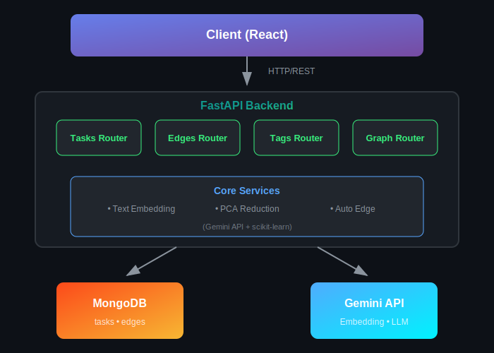
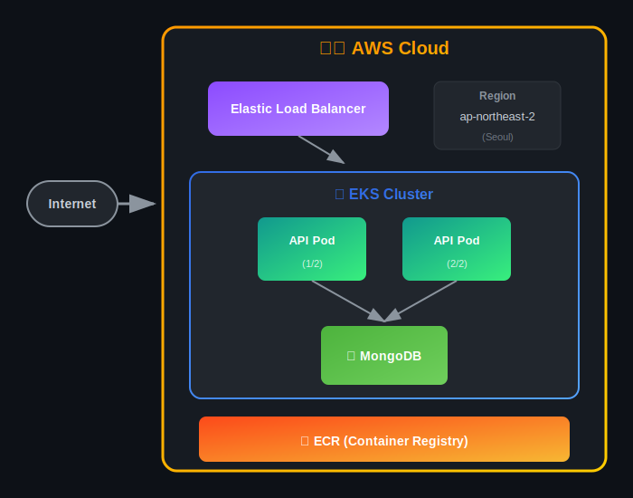

# 🔗 Linkdo Backend

> **AI 기반 태스크 그래프 관리 시스템의 백엔드 API**

태스크를 노드로, 연관성을 엣지로 표현하여 **그래프 형태로 시각화**하는 태스크 관리 앱의 백엔드입니다.  
Google Gemini API를 활용한 **텍스트 임베딩**과 **PCA 차원 축소**를 통해 유사한 태스크를 자동으로 군집화합니다.

<br>

## ✨ 주요 기능

### 🧠 AI 기반 태스크 배치
- **텍스트 임베딩**: Google Gemini API로 태스크의 제목, 설명, 태그를 벡터화
- **PCA 차원 축소**: 고차원 임베딩을 2D 좌표로 변환하여 시각화
- **자동 군집화**: 의미적으로 유사한 태스크들이 가까이 배치됨

### 🔗 자동 엣지 연결
- 태스크 생성 시 **공통 태그 기반**으로 기존 태스크와 자동 연결
- 엣지 가중치 = `공통 태그 수 / 최대 태그 수`

### 🏷️ AI 태그 추천
- Gemini LLM을 활용한 **맥락 기반 태그 제안**
- 기존 태그 목록을 참고하여 일관성 있는 태그 추천

### 📊 그래프 자동 정렬
- 전체 태스크를 PCA로 재계산하여 **최적의 배치** 제공
- StandardScaler로 정규화하여 일관된 시각화

### 🔐 Workspace 기반 데이터 분리
- 각 사용자/브라우저별 **독립적인 데이터 공간** 제공
- `X-Workspace-ID` 헤더로 데이터 격리

<br>

## 🛠️ 기술 스택

| 영역 | 기술 |
|------|------|
| **Framework** | FastAPI (Python 3.11) |
| **Database** | MongoDB 7.0 |
| **AI/ML** | Google Gemini API (gemini-2.5-flash, gemini-embedding-001), scikit-learn (PCA) |
| **Container** | Docker, Docker Compose |
| **Orchestration** | Kubernetes (minikube / AWS EKS) |
| **Cloud** | AWS (ECR, EKS, S3) |

<br>

## 🏗️ 시스템 아키텍처

<p align="center">
  
</p>

<br>

## 📁 프로젝트 구조

```
linkdo-backend/
├── main.py              # FastAPI 앱 진입점, 설정
├── models.py            # Pydantic 데이터 모델
├── routes/
│   ├── tasks.py         # 태스크 CRUD API
│   ├── edges.py         # 엣지 CRUD API
│   ├── tags.py          # 태그 조회/추천 API
│   └── graph.py         # 그래프 데이터/자동정렬 API
├── k8s/                  # Kubernetes 매니페스트
│   ├── namespace.yaml
│   ├── secrets.yaml
│   ├── api-deployment.yaml
│   ├── mongo-deployment.yaml
│   └── ingress.yaml      # NGINX Ingress 설정
├── Dockerfile
├── docker-compose.yml
└── requirements.txt
```

<br>

## 📡 API 엔드포인트

### 🔑 인증
모든 API 요청에 `X-Workspace-ID` 헤더가 **필수**입니다.

```bash
curl -H "X-Workspace-ID: your-workspace-id" http://localhost:8080/api/tasks/
```

### Tasks
| Method | Endpoint | Description |
|--------|----------|-------------|
| `GET` | `/api/tasks/` | 전체 태스크 조회 |
| `GET` | `/api/tasks/{id}` | 특정 태스크 조회 |
| `POST` | `/api/tasks/` | 태스크 생성 (임베딩 + 자동 엣지 연결) |
| `PATCH` | `/api/tasks/{id}` | 태스크 부분 수정 |
| `DELETE` | `/api/tasks/{id}` | 태스크 삭제 |
| `DELETE` | `/api/tasks/{id}/cascade` | 태스크 + 연결된 엣지 삭제 |

### Edges
| Method | Endpoint | Description |
|--------|----------|-------------|
| `GET` | `/api/edges/` | 전체 엣지 조회 |
| `POST` | `/api/edges/` | 엣지 생성 |
| `DELETE` | `/api/edges/{id}` | 엣지 삭제 |

### Tags
| Method | Endpoint | Description |
|--------|----------|-------------|
| `GET` | `/api/tags/` | 모든 태그 목록 |
| `POST` | `/api/tags/suggest-tags` | AI 태그 추천 |

### Graph
| Method | Endpoint | Description |
|--------|----------|-------------|
| `GET` | `/api/graph/` | 그래프 데이터 (tasks + edges + 좌표) |
| `POST` | `/api/graph/auto-arrange` | PCA 기반 자동 정렬 |

<br>

## 🚀 실행 방법

### 1. 로컬 개발 환경

```bash
# 의존성 설치
pip install -r requirements.txt

# 환경변수 설정 (.env)
MONGO_URI=mongodb://localhost:27017/linkdo
GEMINI_API_KEY=your_api_key

# 서버 실행
uvicorn main:app --reload --port 8000
```

### 2. Docker Compose

```bash
docker-compose up -d
```

### 3. Kubernetes (minikube) - 로컬

```bash
# minikube 시작
minikube start

# minikube Docker 환경 연결
minikube docker-env | Invoke-Expression  # PowerShell
# eval $(minikube docker-env)            # Linux/Mac

# Docker 이미지 빌드
docker build -t linkdo-backend:latest .

# 리소스 배포
kubectl apply -f k8s/namespace.yaml
kubectl apply -f k8s/secrets.yaml
kubectl apply -f k8s/mongo-deployment.yaml
kubectl apply -f k8s/api-deployment.yaml

# 포트포워딩 (localhost:8080으로 접근)
kubectl port-forward svc/linkdo-api 8080:80 -n linkdo
```

### 3-1. Ingress 설정 (도메인 기반 접근)

```bash
# NGINX Ingress Controller 활성화
minikube addons enable ingress

# Ingress 리소스 배포
kubectl apply -f k8s/ingress.yaml

# hosts 파일에 도메인 추가 (관리자 권한 필요)
# Windows: C:\Windows\System32\drivers\etc\hosts
# Linux/Mac: /etc/hosts
# 아래 내용 추가:
127.0.0.1 api.linkdo.local

# minikube tunnel 실행 (터미널 유지 필요)
minikube tunnel

# 이제 도메인으로 접근 가능
curl http://api.linkdo.local/api/tasks/ -H "X-Workspace-ID: test"
```

### 4. Kubernetes (AWS EKS)

```bash
# 클러스터 생성
eksctl create cluster --name linkdo-cluster --region ap-northeast-2 \
  --nodegroup-name linkdo-nodes --node-type t3.small --nodes 2

# 리소스 배포
kubectl apply -f k8s/namespace.yaml
kubectl apply -f k8s/secrets.yaml
kubectl apply -f k8s/mongo-deployment.yaml
kubectl apply -f k8s/api-deployment.yaml

# URL 확인
kubectl get service linkdo-api -n linkdo
```

<br>

## 🔧 핵심 알고리즘

### 텍스트 임베딩 → 2D 좌표 변환

> **gemini-embedding-001**: 3,072차원 벡터 → PCA → 2D 좌표

```python
# 1. Gemini API로 텍스트 임베딩 생성 (3,072차원)
text = f"{title} {description} {' '.join(tags)}"
embedding = gemini_client.models.embed_content(
    model="gemini-embedding-001",
    contents=text
)

# 2. PCA로 2D 차원 축소
pca = PCA(n_components=2)
coords_2d = pca.fit_transform(embeddings)

# 3. StandardScaler로 정규화 및 스케일링
scaler = StandardScaler()
coords_2d = scaler.fit_transform(coords_2d) * 40
```

### 자동 엣지 연결

```python
# 공통 태그가 있는 기존 태스크 검색
existing_tasks = tasks_collection.find({
    "id": {"$ne": new_task.id},
    "tags": {"$in": new_task.tags},
    "workspace_id": workspace_id  # 같은 workspace 내에서만
})

# 가중치 계산 및 엣지 생성
for task in existing_tasks:
    common_tags = set(new_task.tags) & set(task.tags)
    weight = len(common_tags) / max(len(new_task.tags), len(task.tags))
    edges_collection.insert_one({
        "source": new_task.id,
        "target": task.id,
        "weight": weight,
        "workspace_id": workspace_id
    })
```

<br>

## 📊 데이터 모델

### Task
```typescript
{
  id: string;            // 고유 식별자
  workspace_id: string;  // 워크스페이스 ID
  title: string;         // 제목
  description?: string;  // 설명
  priority: "low" | "medium" | "high" | "critical";
  status: "todo" | "in-progress" | "done";
  category: string;      // 카테고리
  tags: string[];        // 태그 배열
  embedding: number[];   // 임베딩 벡터
  due_date?: datetime;   // 마감일
}
```

### Edge
```typescript
{
  id: string;            // 고유 식별자
  workspace_id: string;  // 워크스페이스 ID
  source: string;        // 시작 태스크 ID
  target: string;        // 끝 태스크 ID
  weight: number;        // 연관도 (0~1)
}
```

<br>

## 🌐 배포 아키텍처 (AWS EKS)

<p align="center">
  
</p>

<br>

## 📝 환경 변수

| 변수명 | 설명 | 기본값 |
|--------|------|--------|
| `MONGO_URI` | MongoDB 연결 문자열 | `mongodb://localhost:27017/linkdo` |
| `GEMINI_API_KEY` | Google Gemini API 키 | - |

<br>

## 🔗 관련 저장소

| 저장소 | 설명 |
|--------|------|
| [linkdo-frontend](https://github.com/your-username/linkdo-frontend) | React 기반 프론트엔드 |

<br>

## 📄 라이선스

MIT License

<br>
